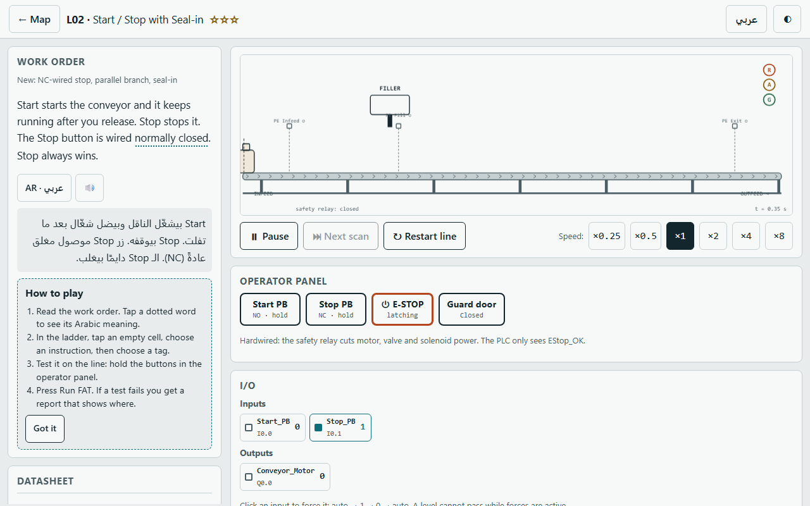
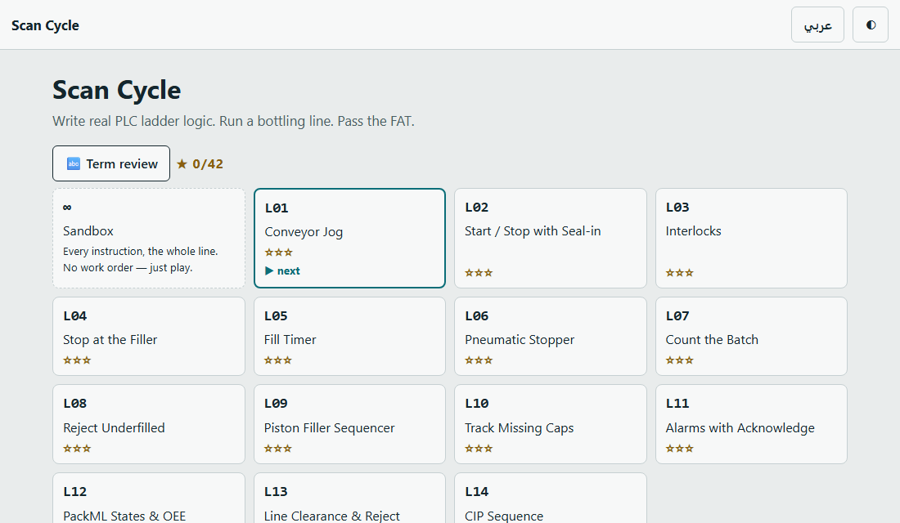
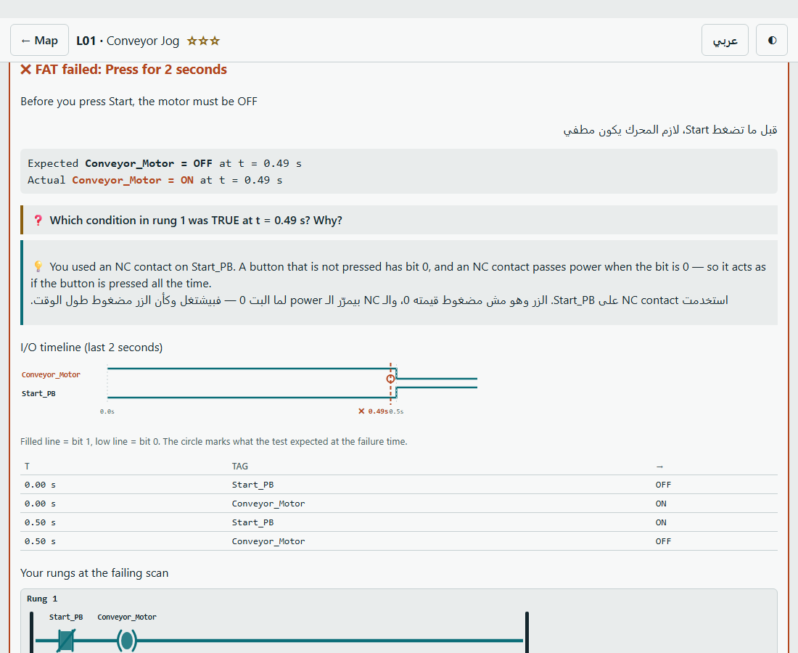
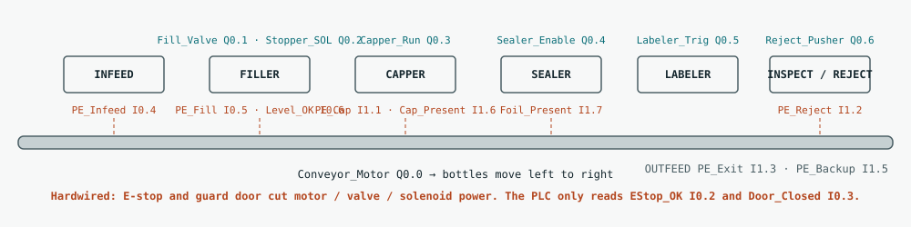
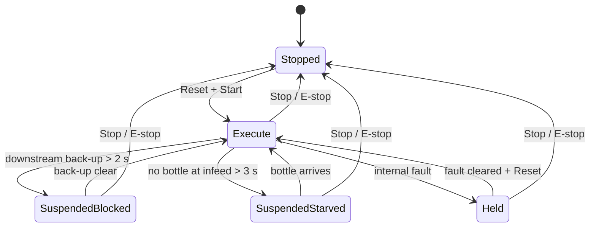
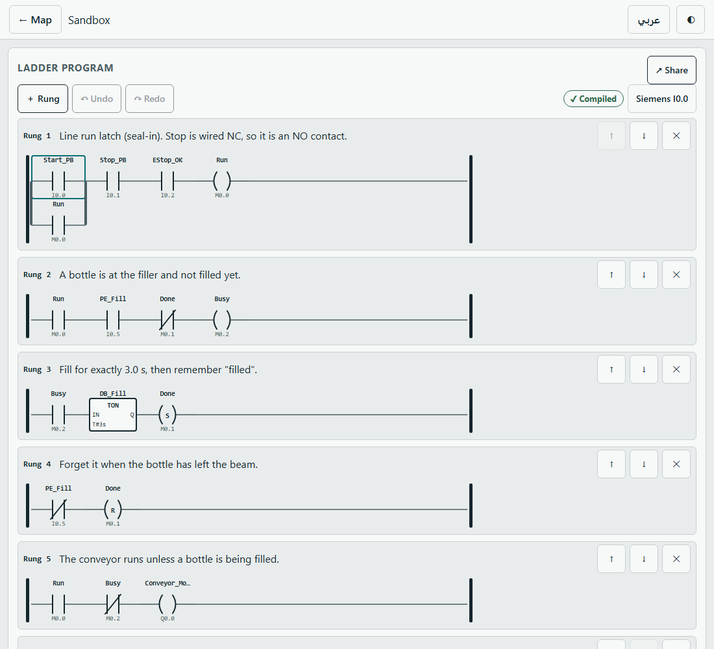
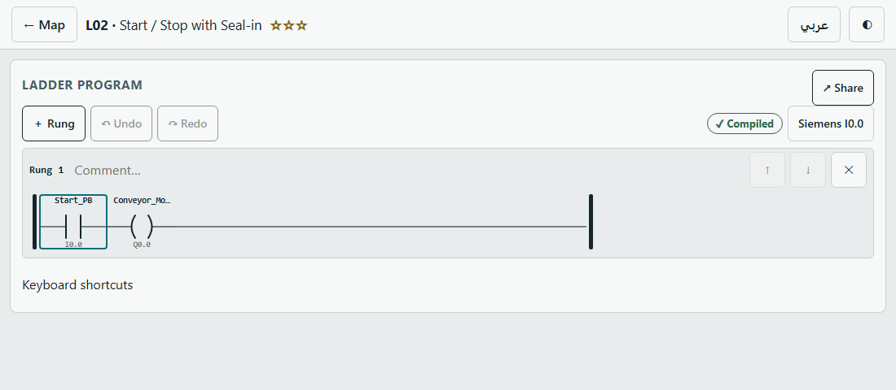

# Scan Cycle

**A browser game that teaches real PLC ladder logic on a pharmaceutical bottle-filling line.**
You write the ladder logic. The game runs the line and grades your program like a FAT (factory acceptance test) — with fault injection, E-stop in the middle of a cycle, and hidden randomized variants.

**▶ Play it:** https://itsak7m.github.io/scan-cycle/ — works offline, no install, no account.
Source: single file `index.html` (vanilla JS, no framework, no build step to play) · MIT license.

## ملخص بالعربي

لعبة بالمتصفح بتعلّمك برمجة PLC بلغة الـ ladder logic على خط تعبئة أدوية حقيقي (شرابات).
إنت بتكتب المنطق، واللعبة بتشغّل الخط بدورة مسح (scan cycle) كل 10 ms وبتفحص برنامجك بسيناريوهات اختبار زي الـ FAT، فيها أعطال وزر طوارئ وتوقيتات عشوائية مخفية.
كل مصطلح تقني إله شرح بالعربي، ومن المرة الثانية بتجيك أسئلة مراجعة. مستوى الفحص بيعطيك تقرير بالضبط وين فشل منطقك.
في 14 مستوى: من تشغيل ناقل بزر لحد تتابع تنظيف CIP.
المشروع مفتوح المصدر، وقابل للتوسع: كل مستوى ملف JSON (انظر `docs/level-format.md`).

## Problem

Learning a PLC without hardware is hard: videos show *someone else's* logic, and simulators that run your program rarely tell you *why* it is wrong.
Scan Cycle gives a beginner a small, realistic line (24–40 bottles/min, amber PET bottles, child-resistant caps, induction seal), an editor styled after TIA Portal, and a
test bench that behaves like a real FAT: it tests nominal behaviour, edge cases, fault injection and E-stop mid-cycle, then explains the first failing assertion with an
I/O timeline and the rungs that were active at that scan.

## Play it

Open the link above, or double-click `index.html` from a download. Level 1 shows a moving line within two minutes of opening the page.
Progress is saved in your browser; use **Export** on the station map to keep a copy.

| Station map | Failure report |
|---|---|
|  |  |

## The line

Stations light up as levels introduce them: conveyor and filler first, then the pneumatic stopper, counting, reject, piston filler, tracking, alarms, PackML states, the pharma challenge test and CIP.

## I/O list

Addresses are stable across levels. Siemens-style names (`I0.0`) with a CODESYS toggle (`%IX0.0`) in the editor.

<!--IO:START-->
| Tag | Address | Type | Wiring / role | Description (EN) | الوصف (AR) |
|---|---|---|---|---|---|
| `Start_PB` | `I0.0` | Bool | NO · start | Start push button (momentary) | زر تشغيل لحظي |
| `Stop_PB` | `I0.1` | Bool | NC · stop | Stop push button (wired normally closed) | زر إيقاف موصول NC |
| `EStop_OK` | `I0.2` | Bool | NC · estop | Safety relay feedback, 1 = healthy | تغذية راجعة من رلاي السلامة |
| `Door_Closed` | `I0.3` | Bool | NC · guard | Guard door closed = 1 | باب الحماية مغلق |
| `PE_Infeed` | `I0.4` | Bool | NO · sensor | Photo-eye, bottle at infeed | عين ضوئية عند المدخل |
| `PE_Fill` | `I0.5` | Bool | NO · sensor | Photo-eye, bottle at filler | عين ضوئية عند الحشّاء |
| `Level_OK` | `I0.6` | Bool | NO · sensor | Through-beam, fill level reached | حساس مستوى التعبئة |
| `Ack_PB` | `I0.7` | Bool | NO · ack | Alarm acknowledge | إقرار الإنذار |
| `Reset_PB` | `I1.0` | Bool | NO · reset | Reset after safety stop / batch | إعادة ضبط |
| `PE_Cap` | `I1.1` | Bool | NO · sensor | Photo-eye at capper | عين ضوئية عند الغطّاء |
| `PE_Reject` | `I1.2` | Bool | NO · sensor | Photo-eye at reject station | عين ضوئية عند الرفض |
| `PE_Exit` | `I1.3` | Bool | NO · sensor | Photo-eye at outfeed (counting) | عين ضوئية عند المخرج |
| `Release_PB` | `I1.4` | Bool | NO · release | Manual release | تحرير يدوي |
| `PE_Backup` | `I1.5` | Bool | NO · sensor | Downstream back-up (blocked) | تراكم المصبّ |
| `Cap_Present` | `I1.6` | Bool | NO · sensor | Cap detected after capper | غطاء موجود |
| `Foil_Present` | `I1.7` | Bool | NO · sensor | Induction foil detected | رقاقة الختم موجودة |
| `Stopper_Ext` | `I2.0` | Bool | NO · feedback | Stopper cylinder extended (reed switch) | المصدّ ممدود |
| `Stopper_Ret` | `I2.1` | Bool | NO · feedback | Stopper cylinder retracted (reed switch) | المصدّ مسحوب |
| `Air_OK` | `I2.2` | Bool | NO · feedback | Air pressure OK (pressure switch) | ضغط الهواء سليم |
| `Tank_LSL` | `I2.3` | Bool | NO · alarm | Tank low level, 1 = alarm | مستوى الخزان منخفض |
| `Tank_LSLL` | `I2.4` | Bool | NO · alarm | Tank low-low level, 1 = alarm | مستوى الخزان منخفض جدًا |
| `Pump_Home` | `I2.5` | Bool | NO · feedback | Piston pump at home (proximity) | المضخة في البداية |
| `Pump_Full` | `I2.6` | Bool | NO · feedback | Piston pump at full stroke (proximity) | المضخة في النهاية |
| `Conv_Encoder` | `I2.7` | Bool | NO · encoder | Encoder: one pulse per bottle pitch | نبضة لكل خطوة |
| `Clear_Sign1` | `I3.0` | Bool | NO · key | Line-clearance sign-off 1 | توقيع تنظيف الخط ١ |
| `Clear_Sign2` | `I3.1` | Bool | NO · key | Line-clearance sign-off 2 | توقيع تنظيف الخط ٢ |
| `Supervisor_Key` | `I3.2` | Bool | NO · key | Supervisor key for setpoints | مفتاح المشرف |
| `Challenge_Bottle` | `I3.3` | Bool | NO · sensor | Marked test bottle present at the reject station | قارورة اختبار الرفض موجودة |
| `CIP_Mode` | `I3.4` | Bool | NO · process | CIP mode selector | مفتاح وضع التنظيف CIP |
| `CIP_Temp_OK` | `I3.5` | Bool | NO · process | CIP temperature OK | حرارة التنظيف سليمة |
| `CIP_Cond_OK` | `I3.6` | Bool | NO · process | CIP conductivity OK | الموصلية سليمة |
| `CIP_Flow_OK` | `I3.7` | Bool | NO · process | CIP flow OK | التدفق سليم |
| `Mode_Auto` | `I4.0` | Bool | NO · mode | Auto mode selected | الوضع الأوتوماتيكي |
| `SP_Request` | `I4.1` | Bool | NO · setpoint | Operator requests a setpoint change | طلب تغيير قيمة ضبط |
| `Tank_Level` | `IW64` | Int | NO · analog | Tank level 4–20 mA scaled 0–27648 (display only) | مستوى الخزان التناظري |
| `SP_Entry` | `IW66` | Int | NO · setpoint | Operator-entered setpoint (ms) | القيمة اللي دخّلها المشغّل |
| `Conveyor_Motor` | `Q0.0` | Bool | actuator | Conveyor contactor | محرك الناقل |
| `Fill_Valve` | `Q0.1` | Bool | actuator | Fill solenoid valve | صمام التعبئة |
| `Stopper_SOL` | `Q0.2` | Bool | actuator | Stopper cylinder solenoid (1 = extend) | صمام أسطوانة المصدّ |
| `Capper_Run` | `Q0.3` | Bool | actuator | Capper (rising edge = one capping stroke) | الكابّر |
| `Sealer_Enable` | `Q0.4` | Bool | actuator | Induction sealer enable | تفعيل ختم الحث |
| `Labeler_Trig` | `Q0.5` | Bool | actuator | Labeler trigger (rising edge) | تشغيل الملصق |
| `Reject_Pusher` | `Q0.6` | Bool | actuator | Reject pusher solenoid | دافع الرفض |
| `Alarm_Lamp` | `Q0.7` | Bool | signal | Alarm lamp | مصباح الإنذار |
| `Horn` | `Q1.0` | Bool | signal | Horn | البوق |
| `Stack_Green` | `Q1.1` | Bool | signal | Stack light green | عمود الإشارة أخضر |
| `Stack_Amber` | `Q1.2` | Bool | signal | Stack light amber | عمود الإشارة كهرماني |
| `Stack_Red` | `Q1.3` | Bool | signal | Stack light red | عمود الإشارة أحمر |
| `Pump_Fwd` | `Q1.4` | Bool | actuator | Piston pump dispense | المضخة دفع |
| `Pump_Rev` | `Q1.5` | Bool | actuator | Piston pump draw | المضخة سحب |
| `Batch_Lamp` | `Q1.6` | Bool | signal | Batch complete lamp | مصباح اكتمال الدفعة |
| `CIP_Pump` | `Q2.0` | Bool | actuator | CIP pump | مضخة التنظيف |
| `CIP_Caustic_Valve` | `Q2.1` | Bool | actuator | CIP caustic valve | صمام القلوي |
| `CIP_Rinse_Valve` | `Q2.2` | Bool | actuator | CIP rinse valve | صمام الشطف |
| `CIP_Drain_Valve` | `Q2.3` | Bool | actuator | CIP drain valve | صمام التصريف |
| `CIP_Done` | `Q2.4` | Bool | signal | CIP done | انتهى التنظيف |
<!--IO:END-->

## Sequence of operation (filler cell, levels 4–6)

1. Operator presses **Reset**, then **Start**. The line only starts when `EStop_OK` and `Door_Closed` are 1 (interlock, no auto-restart).
2. The conveyor runs; a bottle reaches the filler photo-eye `PE_Fill`.
3. The pneumatic stopper extends; the reed switch `Stopper_Ext` confirms before filling.
4. `Fill_Valve` opens for exactly 3.0 s (TON), then closes. Level is checked with `Level_OK`.
5. The stopper retracts; `Stopper_Ret` confirms; the conveyor releases the bottle.
6. A bottle with `Level_OK` = 0 is pushed off at the reject station with a 500 ms pulse; good bottles pass untouched.
7. Bottles are counted at the exit; at the batch size the batch lamp turns on and the infeed stops.

Line states used from level 12 (PackML, simplified):

## Safety & interlocks

**The PLC only monitors the E-stop; the safety relay cuts the power.** In the plant model the E-stop and the guard door open a hardwired safety relay that cuts motor, valve and
solenoid power whatever the ladder does, and a red "SAFETY RELAY OPEN" lamp shows it. The PLC receives `EStop_OK` and `Door_Closed` as ordinary inputs and is graded on what *it* does:
stop its own outputs within one scan, and **never restart by itself** — the operator must press Reset, then Start (level 3). Safety logic never moves into the ladder.

## PLC semantics implemented

* **Scan cycle:** fixed 10 ms simulated scan. Inputs are sampled once, rungs run in order 1…N, coils and blocks write memory immediately (later rungs see earlier writes), outputs are copied to the plant after the last rung.
  Consequences the game teaches: timer resolution is one scan, a pulse shorter than a scan can be missed, a **double coil** means the last write wins.
* **Determinism:** `scan()` and the plant step are pure functions of state, inputs and a seeded PRNG — headless test runs and real-time replays are identical, byte for byte.
* **Instructions:** NO / NC contacts, assignment / Set / Reset coils, positive / negative edge (with their own M bit), TON, TOF, TP, TONR, CTU, CTD, CTUD, compare, move, add / subtract, shift word.
  Timer / counter state lives in runtime memory keyed by instance name (like an instance DB).

| Block | Behaviour (as implemented in `src/core/blocks.js`) |
|---|---|
| TON | IN on → `ET = min(ET + dt, PT)`, Q when `ET ≥ PT`; IN off → ET = 0, Q = 0 |
| TOF | IN on → Q = 1, ET = 0; IN off and Q → `ET += dt`, Q off at `ET ≥ PT` |
| TP | rising edge starts a pulse of exactly PT; not retriggerable while running |
| TONR | like TON but ET is kept when IN drops; R resets ET and Q |
| CTU / CTD / CTUD | count rising edges; R / LD have priority; Q = `CV ≥ PV` / `CV ≤ 0` |

* **Lint:** double coil, shared timer instance, reused edge bit, unused tag, `ADD` without edge, NC contact on an NC-wired stop button, branches left open.

## Ladder examples

| Sandbox demo — a working fill cycle (commented rungs) | L02 starter — a completion exercise |
|---|---|
|  |  |

The Stop button is wired **normally closed**, so its bit is 1 when idle — it is tested with a **normal-open contact**. The contact symbol tests the *bit*, not the device. A broken wire reads 0 and stops the machine (fail-safe).
(The level solutions are hidden test fixtures; these screenshots show the sandbox demo and an unfinished exercise on purpose.)

## Test scenarios & results

Every level carries 3–6 visible FAT scenarios plus hidden randomized variants (arrival jitter, timing phase, seeds). The self-test runs each scenario against a hidden reference
solution and requires each documented *wrong* solution to fail with the right diagnosis (`python tools/selftest.py`).

<!--TESTLOG:START-->
- **L01 Conveyor Jog** — 4 visible + 5 hidden scenarios pass with the reference solution; 3 documented wrong solutions are rejected with the right diagnosis.
- **L02 Start / Stop with Seal-in** — 5 visible + 6 hidden scenarios pass with the reference solution; 4 documented wrong solutions are rejected with the right diagnosis.
- **L03 Interlocks** — 6 visible + 6 hidden scenarios pass with the reference solution; 5 documented wrong solutions are rejected with the right diagnosis.
- **L04 Stop at the Filler** — 5 visible + 8 hidden scenarios pass with the reference solution; 4 documented wrong solutions are rejected with the right diagnosis.
- **L05 Fill Timer** — 5 visible + 8 hidden scenarios pass with the reference solution; 5 documented wrong solutions are rejected with the right diagnosis.
- **L06 Pneumatic Stopper** — 5 visible + 8 hidden scenarios pass with the reference solution; 6 documented wrong solutions are rejected with the right diagnosis.
- **L07 Count the Batch** — 4 visible + 8 hidden scenarios pass with the reference solution; 6 documented wrong solutions are rejected with the right diagnosis.
- **L08 Reject Underfilled** — 5 visible + 8 hidden scenarios pass with the reference solution; 6 documented wrong solutions are rejected with the right diagnosis.
- **L09 Piston Filler Sequencer** — 5 visible + 8 hidden scenarios pass with the reference solution; 6 documented wrong solutions are rejected with the right diagnosis.
- **L10 Track Missing Caps** — 5 visible + 10 hidden scenarios pass with the reference solution; 6 documented wrong solutions are rejected with the right diagnosis.
- **L11 Alarms with Acknowledge** — 6 visible + 8 hidden scenarios pass with the reference solution; 6 documented wrong solutions are rejected with the right diagnosis.
- **L12 PackML States & OEE** — 5 visible + 10 hidden scenarios pass with the reference solution; 5 documented wrong solutions are rejected with the right diagnosis.
- **L13 Line Clearance & Reject Challenge** — 5 visible + 6 hidden scenarios pass with the reference solution; 10 documented wrong solutions are rejected with the right diagnosis.
- **L14 CIP Sequence** — 5 visible + 6 hidden scenarios pass with the reference solution; 6 documented wrong solutions are rejected with the right diagnosis.

Full test table (70 visible scenarios)

| Test ID | Level | Mode | Inputs | Expected | Result |
|---|---|---|---|---|---|
| `L01-press-2s` | L01 | Nominal | press Start_PB 2 s @ 0.5 s | Before you press Start, the motor must be OFF; The motor must start in the same scan that sees Start | ✔ pass |
| `L01-tap-03s` | L01 | Edge case | press Start_PB 0.3 s @ 1 s | The motor must be OFF before the tap; Even a short tap must start the motor | ✔ pass |
| `L01-hold-5s` | L01 | Edge case | press Start_PB 5 s @ 0.5 s | The motor must run the whole time Start is held; The motor must stop when Start is released | ✔ pass |
| `L01-two-presses` | L01 | Edge case | press Start_PB 1 s @ 0.5 s; press Start_PB 1.5 s @ 3 s | Released: the motor must be OFF; Between the presses the motor must stay OFF | ✔ pass |
| *L01 hidden* | L01 | Randomised | 5 variants (seeds 1000+, shifted timing, jitter) | same assertions as the visible tests | ✔ pass |
| `L02-start-tap` | L02 | Edge case | press Start_PB 0.3 s @ 0.5 s | Before Start the motor must be OFF; Start must start the motor | ✔ pass |
| `L02-stop-tap` | L02 | Edge case | press Start_PB 0.3 s @ 0.5 s; press Stop_PB 0.3 s @ 3 s | Stop must stop the motor in the same scan; After Stop the motor must stay OFF | ✔ pass |
| `L02-stop-wins` | L02 | Nominal | press Start_PB 0.3 s @ 0.5 s; press Start_PB 1.5 s @ 2 s; press Stop_PB 0.5 s @ 2 s | While Stop is pressed the motor must be OFF, even if Start is pressed too; Stop was released while Start was held, so the motor runs again and keeps running | ✔ pass |
| `L02-wire-break` | L02 | Edge case | press Start_PB 0.3 s @ 0.5 s; set Stop_PB=0 @ 3 s; press Start_PB 0.3 s @ 5 s | A broken Stop wire reads 0, like a pressed Stop: the motor must stop; With the Stop wire broken the motor must not start | ✔ pass |
| `L02-stop-held` | L02 | Edge case | set Stop_PB=0 @ 0 s; press Start_PB 0.3 s @ 0.5 s; set Stop_PB=1 @ 2 s; press Start_PB 0.3 s @ 2.5 s | Start must not work while Stop is held; After Stop is released, Start works again | ✔ pass |
| *L02 hidden* | L02 | Randomised | 6 variants (seeds 2000+, shifted timing, jitter) | same assertions as the visible tests | ✔ pass |
| `L03-normal` | L03 | Nominal | press Reset_PB 0.3 s @ 0.5 s; press Start_PB 0.3 s @ 1.5 s; press Stop_PB 0.3 s @ 4 s | Reset alone must not start the conveyor; After Reset, Start must start the conveyor | ✔ pass |
| `L03-estop-mid-run` | L03 | E-stop / door | press Reset_PB 0.3 s @ 0.5 s; press Start_PB 0.3 s @ 1.5 s; E-stop pressed @ 4 s | E-stop: the PLC output must go OFF within one scan; With the E-stop pressed the conveyor must stay OFF | ✔ pass |
| `L03-no-auto-restart` | L03 | E-stop / door | press Reset_PB 0.3 s @ 0.5 s; press Start_PB 0.3 s @ 1.5 s; E-stop pressed @ 4 s; E-stop released @ 6 s; press Start_PB 0.3 s @ 7 s | When the E-stop is released the conveyor must NOT start by itself; Start without Reset must not work after an E-stop | ✔ pass |
| `L03-reset-start` | L03 | E-stop / door | press Reset_PB 0.3 s @ 0.5 s; press Start_PB 0.3 s @ 1.5 s; E-stop pressed @ 4 s; E-stop released @ 5 s; press Reset_PB 0.3 s @ 6 s; press Start_PB 0.3 s @ 7 s | Reset alone must not restart the conveyor; Reset, then Start: the conveyor must run again | ✔ pass |
| `L03-door-open` | L03 | E-stop / door | press Reset_PB 0.3 s @ 0.5 s; press Start_PB 0.3 s @ 1.5 s; door open @ 4 s; door closed @ 6 s; press Start_PB 0.3 s @ 6.5 s; press Reset_PB 0.3 s @ 8 s; … | Door open: the conveyor must stop within one scan; After the door is closed again the conveyor still needs Reset, then Start | ✔ pass |
| `L03-door-during-reset` | L03 | E-stop / door | press Reset_PB 2 s @ 0.5 s; door open @ 1 s; door closed @ 3 s; press Start_PB 0.3 s @ 3.5 s | Reset must not work while the door is open, and the line stays blocked until a new Reset | ✔ pass |
| *L03 hidden* | L03 | Randomised | 6 variants (seeds 3000+, shifted timing, jitter) | same assertions as the visible tests | ✔ pass |
| `L04-arrive-stop` | L04 | Nominal | — | With no bottle at the filler the conveyor must run by itself; When the bottle reaches PE_Fill the conveyor must stop at once | ✔ pass |
| `L04-release` | L04 | Nominal | press Release_PB 1 s @ 6 s | Before Release the bottle waits at the filler; Release must start the conveyor | ✔ pass |
| `L04-short-tap` | L04 | Edge case | press Release_PB 0.1 s @ 6 s | Before Release the bottle waits at the filler; Even a short tap must start the conveyor | ✔ pass |
| `L04-two-queued` | L04 | Edge case | press Release_PB 0.3 s @ 4 s | Each bottle must stop when it reaches PE_Fill; The first bottle waits at the filler for Release | ✔ pass |
| `L04-power-up` | L04 | Edge case | press Release_PB 0.3 s @ 3 s | A bottle is already in the beam at power-up: the conveyor must not move; Release must still let this bottle go | ✔ pass |
| *L04 hidden* | L04 | Randomised | 8 variants (seeds 4000+, shifted timing, jitter) | same assertions as the visible tests | ✔ pass |
| `L05-one-bottle` | L05 | Nominal | — | The bottle reached the filler: the conveyor must stop; A bottle is at the filler: the fill valve must open | ✔ pass |
| `L05-valve-timing` | L05 | Nominal | — | A bottle is already at the filler: the valve must open at once; The conveyor must stay OFF while the bottle is being filled | ✔ pass |
| `L05-two-close` | L05 | Edge case | — | Every bottle at the filler must get its own fill; The valve must close after 3.0 seconds | ✔ pass |
| `L05-eye-stuck` | L05 | Fault injection | fault peStuckOn PE_Fill @ 1.5 s | The first bottle is at the filler: fill it; The first bottle must get exactly 3.0 seconds, even if the eye sticks | ✔ pass |
| `L05-no-bottle` | L05 | Nominal | — | There is no bottle at the filler: the valve must stay closed; The filler is empty: the conveyor must run by itself | ✔ pass |
| *L05 hidden* | L05 | Randomised | 8 variants (seeds 5000+, shifted timing, jitter) | same assertions as the visible tests | ✔ pass |
| `L06-nominal` | L06 | Nominal | — | The first bottle is on its way and the stopper is not extended. Extend the stopper before the bottle arrives; A bottle is at the filler: the conveyor must stop | ✔ pass |
| `L06-power-up` | L06 | Edge case | — | The valve opened before Stopper_Ext said extended. A bottle is already here: extend the stopper first, then fill; The reed switch says extended and a bottle is present: the fill must start | ✔ pass |
| `L06-low-air` | L06 | Fault injection | fault airLow  @ 0 s | The valve opened before Stopper_Ext said extended. With low air the stopper is slow: do not use a fixed delay, wait for the reed switch; The reed switch says extended and a bottle is present: the fill must start | ✔ pass |
| `L06-air-lost-fill` | L06 | Fault injection | fault airLost  @ 2 s | The fill must be running before the air is lost; Air is lost: hold everything. Close the fill valve | ✔ pass |
| `L06-air-lost-idle` | L06 | Fault injection | fault airLost  @ 1 s; clear airLost @ 6 s | Air is lost: hold everything. The conveyor must stop, even if no bottle is at the filler; Air is lost: no filling | ✔ pass |
| *L06 hidden* | L06 | Randomised | 8 variants (seeds 6000+, shifted timing, jitter) | same assertions as the visible tests | ✔ pass |
| `L07-twelve` | L07 | Nominal | press Start_PB 0.3 s @ 0.5 s | After Start the conveyor must run and the lamp must be OFF while the batch is not complete; The batch lamp must stay OFF until the 12th bottle reaches the exit photo-eye | ✔ pass |
| `L07-long-pulse` | L07 | Edge case | press Start_PB 0.3 s @ 0.5 s | A bottle can stay almost 2 seconds in the beam on a slow belt. It is ONE bottle. With 2 bottles the lamp must stay OFF; Both bottles must pass the exit: Start must run the conveyor | ✔ pass |
| `L07-reset` | L07 | Nominal | press Start_PB 0.3 s @ 0.5 s; press Reset_PB 0.3 s @ 21.5 s; press Start_PB 0.3 s @ 22.5 s | The batch lamp must stay OFF until the 12th bottle reaches the exit photo-eye; At 12 bottles the conveyor must stop: the 12th bottle must not go through | ✔ pass |
| `L07-pause` | L07 | Nominal | press Start_PB 0.3 s @ 0.5 s; press Stop_PB 0.3 s @ 7 s; press Start_PB 0.3 s @ 10 s | Stop must stop the conveyor; The count must not be lost when you press Stop and Start. The lamp must stay OFF until the 12th bottle | ✔ pass |
| *L07 hidden* | L07 | Randomised | 8 variants (seeds 7000+, shifted timing, jitter) | same assertions as the visible tests | ✔ pass |
| `L08-one-bad` | L08 | Nominal | press Start_PB 0.3 s @ 0.5 s | A bad bottle (Level_OK = 0) at the reject photo-eye must start the pusher at once; A good bottle was pushed off. Good bottles must pass untouched | ✔ pass |
| `L08-two-bad` | L08 | Edge case | press Start_PB 0.3 s @ 0.5 s | A bad bottle (Level_OK = 0) at the reject photo-eye must start the pusher at once; A good bottle was pushed off. Good bottles must pass untouched | ✔ pass |
| `L08-bad-next-to-good` | L08 | Nominal | press Start_PB 0.3 s @ 0.5 s | A bad bottle (Level_OK = 0) at the reject photo-eye must start the pusher at once; A good bottle was pushed off. Good bottles must pass untouched | ✔ pass |
| `L08-all-good` | L08 | Nominal | press Start_PB 0.3 s @ 0.5 s | A good bottle was pushed off. Good bottles must pass untouched; With only good bottles the pusher must never move | ✔ pass |
| `L08-pulse-width` | L08 | Nominal | press Start_PB 0.3 s @ 0.5 s | A bad bottle (Level_OK = 0) at the reject photo-eye must start the pusher at once; The pusher pulse must stay ON for at least 300 ms. The pusher needs time to move out, and the bottle moves on | ✔ pass |
| *L08 hidden* | L08 | Randomised | 8 variants (seeds 8000+, shifted timing, jitter) | same assertions as the visible tests | ✔ pass |
| `L09-nominal` | L09 | Nominal | press Start_PB 0.3 s @ 0.5 s | Pump_Fwd and Pump_Rev must never be ON together; Spill: the Fill_Valve was open and the pump moved with no bottle under the nozzle | ✔ pass |
| `L09-estop-dispense` | L09 | E-stop / door | press Start_PB 0.3 s @ 0.5 s; E-stop pressed @ 5.8 s; E-stop released @ 7.8 s; press Start_PB 0.3 s @ 8.8 s | The cycle must be running (step 1 or 2) when the E-stop is pressed; E-stop: Step must go back to 0 and every output must be OFF within two scans | ✔ pass |
| `L09-estop-draw` | L09 | E-stop / door | press Start_PB 0.3 s @ 0.5 s; E-stop pressed @ 4.72 s; E-stop released @ 6.72 s; press Start_PB 0.3 s @ 7.72 s | The draw (step 1) must be running when the E-stop is pressed; E-stop: Step must go back to 0 and every output must be OFF within two scans | ✔ pass |
| `L09-bottle-at-start` | L09 | Nominal | press Start_PB 0.3 s @ 0.5 s | Spill! The old bottle was still leaving the filler beam while the stopper extended. A bottle that moves is not a stopped bottle: wait until it has been there for 0.3 s; The next bottles must still be filled normally | ✔ pass |
| `L09-slow-pump` | L09 | Nominal | press Start_PB 0.3 s @ 0.5 s | Pump_Fwd and Pump_Rev must never be ON together; Spill: the Fill_Valve was open and the pump moved with no bottle under the nozzle | ✔ pass |
| *L09 hidden* | L09 | Randomised | 8 variants (seeds 9000+, shifted timing, jitter) | same assertions as the visible tests | ✔ pass |
| `L10-nominal` | L10 | Fault injection | press Start_PB 0.3 s @ 0.5 s | A bottle WITH a cap was pushed off. Mark only a bottle that is present and has no cap, and push at the right place.; A bottle without a cap left the line. The pusher did not push it. | ✔ pass |
| `L10-gap` | L10 | Fault injection | press Start_PB 0.3 s @ 0.5 s | A good bottle was pushed off. A gap (no bottle) has Cap_Present = 0 too, but it is NOT a missing cap.; A bottle without a cap left the line. Check the bottles next to the gap. | ✔ pass |
| `L10-feeder-empty` | L10 | Fault injection | press Start_PB 0.3 s @ 0.5 s; fault capFeederEmpty  @ 8 s; clear capFeederEmpty @ 14 s | A good bottle was pushed off.; Bottles without a cap came one after the other and one left the line. Every mark must stay on its own bottle. | ✔ pass |
| `L10-speed` | L10 | Fault injection | press Start_PB 0.3 s @ 0.5 s; plant speedPct=60 @ 7 s; plant speedPct=130 @ 17 s | A good bottle was pushed off. A fixed delay does not work when the belt speed changes: count encoder pulses.; A bottle without a cap left the line. The belt was slower or faster than normal: a timer cannot follow it, the encoder can. | ✔ pass |
| `L10-slip` | L10 | Fault injection | fault encoderSlip  @ 0 s; press Start_PB 0.3 s @ 0.5 s | A good bottle was pushed off. A lost pulse moves a mark only 1 pitch (30 mm): good bottles are much farther away than that.; Known limit: a lost pulse can make the pusher miss ONE bottle, but not more. Check that your marks do not drift. | ✔ pass |
| *L10 hidden* | L10 | Randomised | 10 variants (seeds 10000+, shifted timing, jitter) | same assertions as the visible tests | ✔ pass |
| `L11-ack-before-clear` | L11 | Process disturbance | plant tankPct=4 @ 1 s; press Ack_PB 0.3 s @ 4 s; plant tankPct=50 @ 7 s | No alarm: horn and lamp must be OFF; Without an alarm the filler works: keep the starter rung | ✔ pass |
| `L11-ack-after-clear` | L11 | Process disturbance | plant tankPct=12 @ 1 s; plant tankPct=50 @ 3 s; press Ack_PB 0.3 s @ 6 s | A new alarm: the horn must sound at once; The alarm is gone but nobody saw it: the horn must sound until Ack | ✔ pass |
| `L11-intermittent` | L11 | Process disturbance | plant tankPct=4 @ 1 s; plant tankPct=50 @ 1.4 s; plant tankPct=4 @ 2 s; plant tankPct=50 @ 2.4 s; plant tankPct=4 @ 3 s; plant tankPct=50 @ 3.3 s; … | The alarm comes and goes, but the horn must keep sounding until Ack: the alarm must stay latched; The lamp must FLASH while the alarm is not acknowledged: here it was never ON | ✔ pass |
| `L11-lsl-lsll` | L11 | Process disturbance | plant tankPct=12 @ 1 s; press Ack_PB 0.3 s @ 3 s; plant tankPct=4 @ 6 s; press Ack_PB 0.3 s @ 9 s; plant tankPct=50 @ 12 s | LSL is only a warning: filling must go on; A new alarm (LSL): the horn must sound | ✔ pass |
| `L11-jam` | L11 | Fault injection | fault peStuckOn PE_Backup @ 1 s; clear peStuckOn @ 4 s; fault peStuckOn PE_Backup @ 6 s; press Ack_PB 0.3 s @ 13 s; clear peStuckOn @ 18 s | The back-up eye was ON for less than 5 s (or not yet 5 s): that is not a jam, no alarm yet; Back-up eye ON for 5 s: jam alarm, the horn must sound | ✔ pass |
| `L11-chatter` | L11 | Fault injection | fault peChatter PE_Backup @ 1 s; clear peChatter @ 12 s | A chattering sensor is NOT a jam: it never stays ON for 5 s. Use a timer that restarts every time the signal drops | ✔ pass |
| *L11 hidden* | L11 | Randomised | 8 variants (seeds 11000+, shifted timing, jitter) | same assertions as the visible tests | ✔ pass |
| `L12-run-stop` | L12 | E-stop / door | press Start_PB 0.3 s @ 1 s; press Stop_PB 0.3 s @ 6 s; press Start_PB 0.3 s @ 8 s; E-stop pressed @ 12 s; E-stop released @ 14 s; press Start_PB 0.3 s @ 16 s; … | Before Start the line is Stopped: red light, conveyor OFF; Start: the line goes to Execute (green, conveyor runs) | ✔ pass |
| `L12-blocked` | L12 | Process disturbance | press Start_PB 0.3 s @ 1 s; plant outfeedBlocked=True @ 1.5 s; plant outfeedBlocked=False @ 3 s; plant outfeedBlocked=True @ 5 s; plant outfeedBlocked=False @ 26 s | A bottle that waits only about 1 s at the end is NOT a blockage. Pause the conveyor only after the back-up eye was ON for 2 s; Back-up for 2 s: Suspended-Blocked. The conveyor must pause (not red, not green) | ✔ pass |
| `L12-starved` | L12 | Process disturbance | press Start_PB 0.3 s @ 1 s; plant genOn=False @ 5 s; plant genOn=True @ 22 s | Bottles arrive normally: Execute (green). A gap between two bottles is NOT starved: wait 3 s; Starved: the conveyor keeps running (only the amber light changes) | ✔ pass |
| `L12-held` | L12 | Fault injection | press Start_PB 0.3 s @ 1 s; fault airLost  @ 8 s; press Start_PB 0.3 s @ 11 s; clear airLost @ 14 s; press Start_PB 0.3 s @ 18 s | Execute: green steady, conveyor runs; Air lost (an internal fault): the line is Held. Steady amber, conveyor stopped | ✔ pass |
| `L12-slow` | L12 | Nominal | press Start_PB 0.3 s @ 1 s | The line is slow but nothing is wrong: it is still Execute (green). The stack light does not show the loss - OEE does; Performance should be about 85 %: the belt runs at 85 % speed. (0 % means the conveyor never ran) | ✔ pass |
| *L12 hidden* | L12 | Randomised | 10 variants (seeds 12000+, shifted timing, jitter) | same assertions as the visible tests | ✔ pass |
| `L13-nominal` | L13 | Fault injection | press Clear_Sign1 0.4 s @ 1 s; press Clear_Sign2 0.4 s @ 2 s; press Start_PB 0.3 s @ 3 s | The two sign-offs alone must not start the conveyor. Start is still needed.; After two different sign-offs, Start must run the conveyor. | ✔ pass |
| `L13-one-key` | L13 | Nominal | press Clear_Sign1 0.4 s @ 1 s; press Clear_Sign1 0.4 s @ 2 s; press Start_PB 0.3 s @ 3 s; press Start_PB 0.3 s @ 4.5 s; press Clear_Sign2 0.4 s @ 6 s; press Start_PB 0.3 s @ 7 s | One sign-off is not enough, even if the same key is pressed twice. Two different signs are needed.; Now Sign 1 and Sign 2 are both done: Start must run the conveyor. | ✔ pass |
| `L13-keys-together` | L13 | Nominal | press Clear_Sign1 0.5 s @ 1 s; press Clear_Sign2 0.5 s @ 1 s; press Start_PB 0.3 s @ 3 s; press Clear_Sign1 0.4 s @ 4 s; press Clear_Sign2 0.4 s @ 5 s; press Start_PB 0.3 s @ 6 s; … | Both keys at the same moment look like one person with two keys. Ignore them: Start must not work.; Sign 1, then Sign 2 later: Start must run the conveyor. | ✔ pass |
| `L13-challenge-fails` | L13 | Fault injection | press Clear_Sign1 0.4 s @ 1 s; press Clear_Sign2 0.4 s @ 2 s; press Start_PB 0.3 s @ 3 s; fault airLost  @ 5 s; plant clearLine=True @ 12 s; press Start_PB 0.3 s @ 15 s; … | The marked bottle is at the reject station: the conveyor must stop.; The marked bottle is still there after 2 s: lock the batch and turn on Alarm_Lamp. | ✔ pass |
| `L13-setpoint` | L13 | Nominal | set SP_Entry=3500 @ 0.5 s; press SP_Request 0.3 s @ 1 s; set Supervisor_Key=1 @ 2 s; press SP_Request 0.3 s @ 2.5 s; set Supervisor_Key=0 @ 4 s; set SP_Entry=2000 @ 4.2 s; … | Without the key, or without a request, the fill time must not change (3000).; The audit trail shows a change made WITHOUT the supervisor key. | ✔ pass |
| *L13 hidden* | L13 | Randomised | 6 variants (seeds 13000+, shifted timing, jitter) | same assertions as the visible tests | ✔ pass |
| `L14-full-cycle` | L14 | Nominal | set CIP_Mode=1 @ 0.5 s; set CIP_Flow_OK=1 @ 1 s; set CIP_Temp_OK=1 @ 36 s; set CIP_Cond_OK=1 @ 101 s; set CIP_Mode=0 @ 114 s | CIP mode is OFF: everything must be OFF.; Step 1, pre-rinse: pump, rinse valve and drain valve ON, caustic valve OFF. | ✔ pass |
| `L14-temp-drop` | L14 | Edge case | set CIP_Mode=1, CIP_Temp_OK=1 @ 0.5 s; set CIP_Flow_OK=1 @ 1 s; set CIP_Temp_OK=0 @ 51 s; set CIP_Temp_OK=1 @ 66 s | After 30 s of flow: step 2, caustic circulation.; The temperature dropped at 51 s (20 s counted) and came back at 66 s. HOLD: keep the 20 s and count 40 s more. The step must end at 106 s, not later. | ✔ pass |
| `L14-cond-flicker` | L14 | Edge case | set CIP_Mode=1, CIP_Temp_OK=1 @ 0.5 s; set CIP_Flow_OK=1 @ 1 s; set CIP_Cond_OK=1 @ 95 s; set CIP_Cond_OK=0 @ 98 s; set CIP_Cond_OK=1 @ 100 s | Step 3, final rinse, starts at 91 s.; Conductivity must be OK for 10 s WITHOUT a break. It dropped at 98 s, so the 10 s start again at 100 s. Done must not come before 110 s. | ✔ pass |
| `L14-flow-lost` | L14 | Nominal | set CIP_Mode=1, CIP_Temp_OK=1 @ 0.5 s; set CIP_Flow_OK=1 @ 1 s; set CIP_Flow_OK=0 @ 11 s; set CIP_Flow_OK=1 @ 21 s | Flow was lost from 11 s to 21 s. HOLD: the pump and the rinse valve stay ON, and the time waits. 10 s were counted, 20 s more are needed, so the step ends at 41 s.; 30 s of flow in total: step 2, caustic circulation, starts at 41 s. | ✔ pass |
| `L14-abort-restart` | L14 | Nominal | set CIP_Mode=1, CIP_Temp_OK=1 @ 0.5 s; set CIP_Flow_OK=1 @ 1 s; set CIP_Mode=0 @ 20 s; set CIP_Mode=1 @ 25 s | CIP mode OFF: everything OFF at once.; With CIP mode OFF everything stays OFF. | ✔ pass |
| *L14 hidden* | L14 | Randomised | 6 variants (seeds 14000+, shifted timing, jitter) | same assertions as the visible tests | ✔ pass |

Self-test total: **500/500 passed** (engine unit tests, plant model, editor, share links, every level).
<!--TESTLOG:END-->

## What broke and what I changed

A short engineering log of real problems found while building and testing:

* **Reset input key collided with the row key** in the program JSON (`r` was both "row" and "reset") — the editor-built TONR looked "outside the grid". Renamed the reset parameter to `rs`.
* **Events lagged one scan.** An E-stop event applied at *t* was only visible to the PLC at *t + 10 ms* because sensors were computed at the end of the previous step. Fixed: hardwired events refresh the sensor snapshot before the scan, so "OFF within one scan" is gradable.
* **`EStop_OK` also went to 0 when the door opened,** so a program that ignored `Door_Closed` still passed level 3. The wrong-solution test caught it. Fixed: two separate bits, both opening the safety relay.
* **TP pulse length.** The textbook formula gave a 490 ms pulse for `PT = 500 ms`; the block now outputs exactly PT so a "500 ms ± 20 ms" assertion is meaningful.
* **A quick tap on a simulated push button was never seen by the PLC** (button released before the next scan). The panel now holds a tap for at least four scans — a small real lesson about scan time.
* **Headless Edge printed nothing with `--dump-dom`;** the self-test runner now uses Chrome.
* **A test could pass without testing.** A review found that an assertion placed at or after the end of a run was silently skipped, and that a typo like `{ge: 1}` was always true.
  Assertions past the end now fail, unknown operators never match, and the level validator rejects both.
* **Untrusted programs.** A share link or an old save with a malformed rung used to crash the editor *and* get saved, locking the level. Programs are now sanitized on every way in
  (share link, import, saved data), `compile()` never throws, and a program that cannot be rendered falls back to the starter.

## Limitations

Simulation only — no real PLC hardware yet. The plant is a simplified model with "game values" for speeds and times. Next step: re-implement a few levels in CODESYS and run them against a soft-PLC to compare behaviour.

## AI assistance note

<!-- TODO(Amir): this is a DRAFT of the verbatim note from the project brief. Edit it so it states exactly what you did yourself before you publish the repo or link it on LinkedIn. -->

AI help: I used Claude (Anthropic) to build the game engine, the plant simulation, the test harness and the first versions of the levels (work orders, FAT scenarios, hidden tests) and of the reference solutions
used by the self-test. The reference solutions are test fixtures: they are never shown in the game. I play the levels myself — the game checks *my* ladder logic against hidden randomized tests — and I review and change
the work orders, interlocks and scenarios. Where AI suggested a code change, the commit message says so.

## How to author a level

A level is one JSON file. See [`docs/level-format.md`](docs/level-format.md): work order (EN + AR), palette, tags, plant config, scenarios with assertions, hidden variants, diagnostics, hints, glossary.
Run `python tools/build.py` to rebuild `index.html`, and `python tools/selftest.py` to run all checks.

Also: [`docs/glossary.md`](docs/glossary.md) (the Arabic–English PLC glossary exported from the game) · [`docs/case-study.md`](docs/case-study.md).

## License

MIT — see [LICENSE](LICENSE). Ideas studied from MIT-licensed `hiperiondev/ladder-editor`, `hiperiondev/ladderlib`, `cdilga/ladder-logic-editor`; no GPL code (LDmicro, OpenPLC) was copied.
